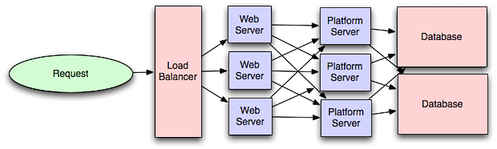

# Capa de Aplicacion

Separando la capa web de la capa de aplicacion (mejor concida como capa de plataforma (platform layer / basicamente backend)) nos permite escalar y configurar ambas capas de manera independiente.
Agregando una nueva API resulta en agregar servidores de aplicacion sin la necesidad de agregar servicios web adicionales.

## Desventajas

- Agregar una capa de aplicación con servicios bajamente acoplados requiere a un enfoque diferente de arquitectura.
- Los microservicios pueden agregar complejidad en términos de deployments y operaciones.
